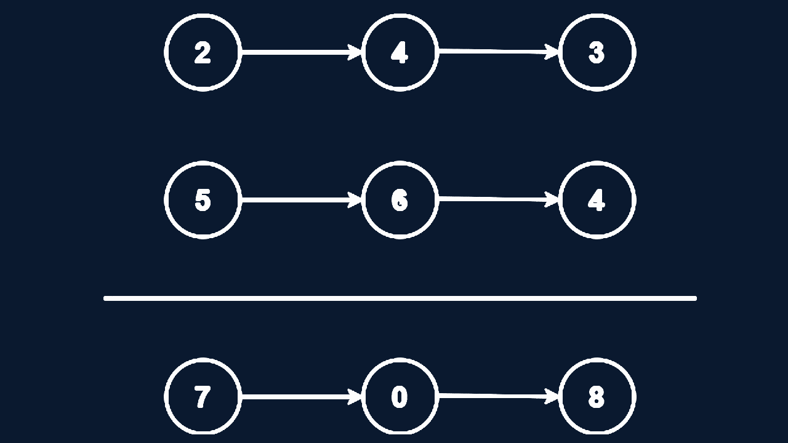

## Description

You are given two **non-empty** linked lists representing two non-negative integers. The digits are stored in **reverse order**, and each of their nodes contains a single digit. Add the two numbers and return the sum as a linked list.

You may assume the two numbers do not contain any leading zero, except the number 0 itself.



```example
Input: l1 = [2,4,3], l2 = [5,6,4]
Output: [7,0,8]
Explanation: 342 + 465 = 807
```

```example
Input: l1 = [0], l2 = [0]
Output: [0]
```

```example
Input: l1 = [9,9,9,9,9,9,9] l2 = [9,9,9,9]
Output: [8,9,9,9,0,0,0,1]
```

**Constraints:**
- The number of nodes in each linked list in the range `[1,100]`.
- `0 <= Node.val <= 9`
- It is guaranteed that the list represents a number that does not have leading zeros.

## Solution

```java
/**
 * Definition for singly-linked list.
 * public class ListNode {
 *     int val;
 *     ListNode next;
 *     ListNode() {}
 *     ListNode(int val) { this.val = val; }
 *     ListNode(int val, ListNode next) { this.val = val; this.next = next; }
 * }
 */
class Solution {
    public ListNode addTwoNumbers(ListNode l1, ListNode l2) {
        ListNode temp = new ListNode(0);
        ListNode curr = temp;
        int carry = 0;
        while(l1!=null || l2!=null || carry!=0){
            int x = (l1!=null)?l1.val:0;
            int y = (l2!=null)?l2.val:0;
            int sum = carry + x + y;
            carry = sum/10;
            curr.next = new ListNode(sum%10);
            curr = curr.next;
            if(l1!=null){
                l1=l1.next;
            }
            if(l2!=null){
             l2=l2.next;   
            }
        }
        return temp.next;
    }
}
```